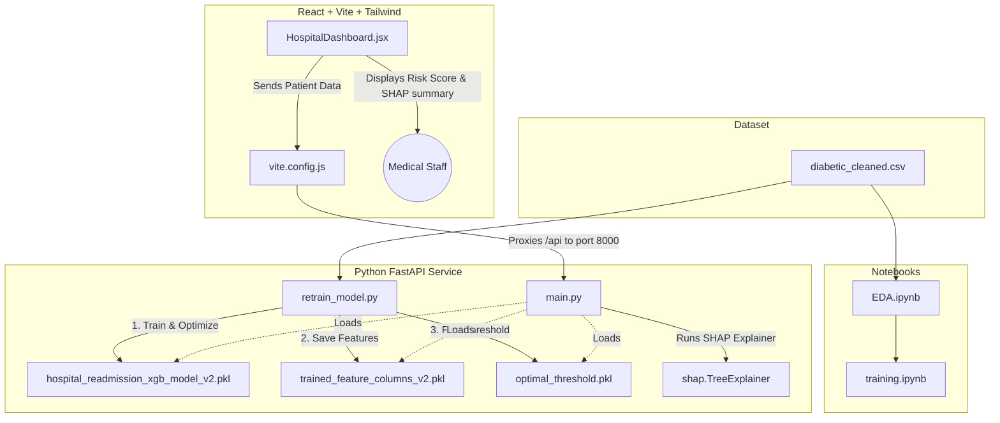

# Personal Project Documentation: Hospital Readmission Risk Engine

This project is an **end-to-end clinical intelligence application** that predicts the 30-day readmission probability of diabetic patients. It leverages a trained machine learning model (**XGBoost**) paired with an explainable AI framework (**SHAP**) to explain predictions based on individual patient metrics, and displays them via a modern, high-fidelity React dashboard.

---

## 📂 Project Architecture



---

## 🛠️ File-by-File Summary & Tech Stack

### 1. Root Directory

* **[update_notebooks.py](file:///c:/Users/prane/OneDrive/Desktop/Projects/personal/update_notebooks.py)**
  * **Role**: A utility script used to modify or run cells across notebooks programmatically.

### 2. Dataset `/dataset`

* **[diabetic_cleaned.csv](file:///c:/Users/prane/OneDrive/Desktop/Projects/personal/dataset/diabetic_cleaned.csv)**
  * **Role**: The core database consisting of ~70,000 anonymized diabetic patient clinical records. It includes details such as demographics, diagnoses, length of hospital stay, medication count, history of visits, and the target variable `readmitted_binary` (0 for no readmission, 1 for readmission within 30 days).

### 3. Notebooks `/notebook`

* **[EDA.ipynb](file:///c:/Users/prane/OneDrive/Desktop/Projects/personal/notebook/EDA.ipynb)**
  * **Role**: Exploratory Data Analysis notebook. Visualizes feature correlations, missing value patterns, demographics distribution, and diagnostic mappings.
* **[training.ipynb](file:///c:/Users/prane/OneDrive/Desktop/Projects/personal/notebook/training.ipynb)**
  * **Role**: Notebook where initial training experiments were conducted. Compares model baselines and computes preliminary F1-scores.

### 4. Backend `/backend`

The backend is written in **Python 3.12** using **FastAPI** as the web framework and **scikit-learn** + **XGBoost** + **SHAP** for the machine learning engine.

* **[requirements.txt](file:///c:/Users/prane/OneDrive/Desktop/Projects/personal/backend/requirements.txt)**
  * **Role**: Manages Python dependencies.
  * **Key libraries**: `fastapi`, `uvicorn`, `pydantic` (API framework), `pandas`, `numpy` (data structure), `scikit-learn` (splitting/metrics), `xgboost` (classifier), `shap` (explainability), `optuna` (hyperparameter search).
* **[retrain_model.py](file:///c:/Users/prane/OneDrive/Desktop/Projects/personal/backend/retrain_model.py)**
  * **Role**: Standalone retraining pipeline.
  * **How it works**:
    1. Loads [diabetic_cleaned.csv](file:///c:/Users/prane/OneDrive/Desktop/Projects/personal/dataset/diabetic_cleaned.csv).
    2. Encodes age ordinally and maps diagnosis codes (`diag_1`) using standard ICD-9 code groupings.
    3. Runs **Optuna** hyperparameter search (30 trials) to find the model parameters that maximize F1-score on validation data.
    4. Applies `scale_pos_weight=10.19` during XGBoost training to account for class imbalance without distorting probability calibration.
    5. Evaluates precision-recall trade-offs to compute the **optimal classification threshold** (which balances precision and recall to achieve optimal F1).
    6. Saves the artifacts: model (`.pkl`), expected column names (`.pkl`), and threshold (`.pkl`).
* **[main.py](file:///c:/Users/prane/OneDrive/Desktop/Projects/personal/backend/main.py)**
  * **Role**: The core API server application.
  * **Endpoints**:
    * `GET /health`: Returns loading status of the model, SHAP availability, and the active threshold.
    * `POST /predict`: Accepts a patient data schema, converts categories into matched one-hot dummy columns using the saved feature list, scores the patient risk, evaluates risk status based on the optimal threshold, runs `shap.TreeExplainer` on the input vector, compiles a natural language explanation, and returns the payload.
* **[hospital_readmission_xgb_model_v2.pkl](file:///c:/Users/prane/OneDrive/Desktop/Projects/personal/backend/hospital_readmission_xgb_model_v2.pkl)**
  * **Role**: The serialized XGBoost classifier model trained with the best hyperparameters.
* **[trained_feature_columns_v2.pkl](file:///c:/Users/prane/OneDrive/Desktop/Projects/personal/backend/trained_feature_columns_v2.pkl)**
  * **Role**: List of all 116 feature columns expected by the model. Ensures that one-hot encoding on single records matches the shape of the dataset used during training.
* **[optimal_threshold.pkl](file:///c:/Users/prane/OneDrive/Desktop/Projects/personal/backend/optimal_threshold.pkl)**
  * **Role**: Optimized float value (`0.5273`) saved during retraining.

### 5. Frontend `/frontend`

A client-side dashboard built using **React (v19)**, **Tailwind CSS (v4)**, and compiled with **Vite**.

* **[package.json](file:///c:/Users/prane/OneDrive/Desktop/Projects/personal/frontend/package.json)**
  * **Role**: Front-end dependency configuration (React, Tailwind CSS, eslint, Vite development server).
* **[vite.config.js](file:///c:/Users/prane/OneDrive/Desktop/Projects/personal/frontend/vite.config.js)**
  * **Role**: Dev server settings. Sets up a proxy redirecting client requests targeting `/api` to the backend running at `http://127.0.0.1:8000`.
* **[src/HospitalDashboard.jsx](file:///c:/Users/prane/OneDrive/Desktop/Projects/personal/frontend/src/HospitalDashboard.jsx)**
  * **Role**: The dashboard interface. Integrates the form containing all clinical and demographic fields, triggers requests, processes states (loading, success, error), and visualizes:
    * **Risk Meter**: Radial display showing the probability percentage.
    * **Clinical Risk Explanation**: A custom text summary parsing backend-provided SHAP analysis.
    * **Feature Attributions**: Visualizing the positive and negative contributors in interactive horizontal bar charts.
* **[src/index.css](file:///c:/Users/prane/OneDrive/Desktop/Projects/personal/frontend/src/index.css)** and **[src/App.css](file:///c:/Users/prane/OneDrive/Desktop/Projects/personal/frontend/src/App.css)**
  * **Role**: Implements global styling, fonts (Inter, Roboto), design tokens, glassmorphic container cards, custom shimmer load masks, and animation classes.

---

## 🚀 How to Run the Project

### Prerequisites
Make sure you have **Python 3.12+** and **Node.js (v18+)** installed.

---

### Step 1: Run the Backend (FastAPI)

1. Open a terminal and navigate to the backend directory:
   ```powershell
   cd backend
   ```
2. Activate the virtual environment:
   ```powershell
   # Windows:
   .\venv\Scripts\activate
   ```
3. Run the API server:
   ```powershell
   uvicorn main:app --reload --port 8000
   ```
   *The backend will now be live on `http://127.0.0.1:8000`.*

---

### Step 2: Run the Frontend (React + Vite)

1. Open a separate terminal and navigate to the frontend directory:
   ```powershell
   cd frontend
   ```
2. Install Node modules:
   ```bash
   npm install
   ```
3. Start the Vite development server:
   ```bash
   npm run dev
   ```
   *The frontend dashboard will be live on `http://localhost:5173/`.*

---

### Step 3: Run Retraining (Optional)
If you wish to retrain the XGBoost model or recalculate the optimal threshold:
1. Navigate to the backend directory with active virtual environment.
2. Run:
   ```powershell
   python retrain_model.py
   ```
   *This will run hyperparameter searches, calculate validation metrics, print diagnostic reports, and overwrite the model pickle files automatically. The running backend server will automatically reload them.*
